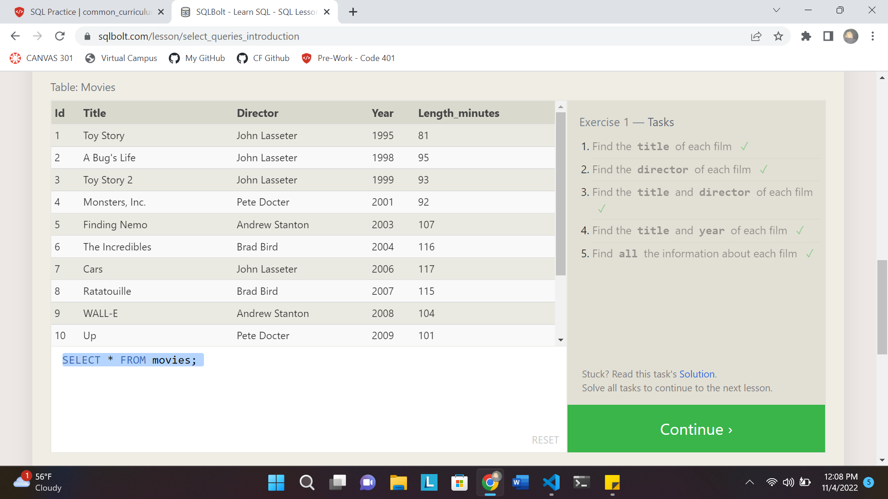
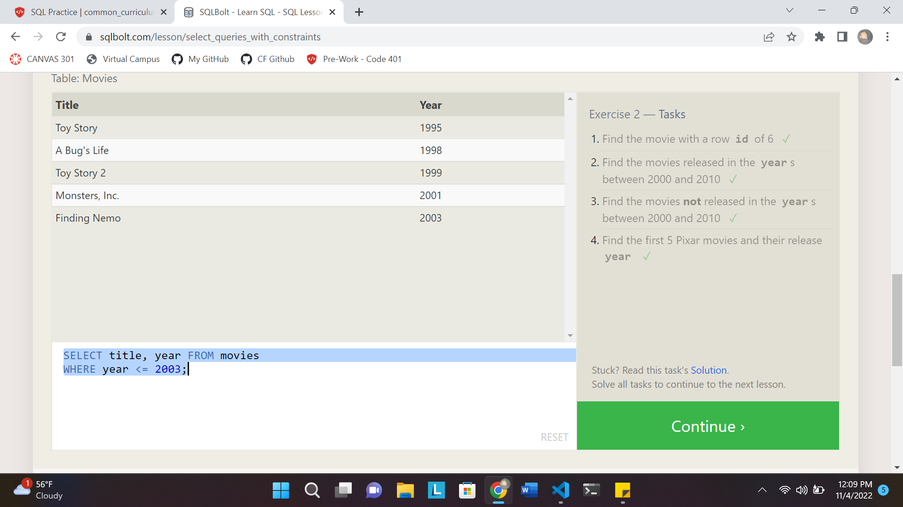

## SQL Basics:
1. SQL = Structured Query Language
2. A language designed to allow both technical and non-technical users to query, manipulate, and transform data from a relational database
3. There are many SQL databases like SQLite, MySQL, Postgres, Oracle, etc.

## Lesson 1:
1. Retrieve data using SELECT statements, called queries
2. A table in SQL can be seen as a type of entity, and each row within the table as a specific instance. (Ex: 'Fish' would be a table, and 'Shark', 'Catfish', 'Swordfish' and the features of the fish would be a row, and features, which must be shared features of Fish, itself such as the length of the tail, type of teeth, etc. column)

## Lesson 2:
1. To filter certain results from returning, use a WHERE clause in the query
EX: 
SELECT column, column_two
FROM mytable
WHERE condition
    AND/OR another_condition
    AND/OR ...;

2. Using operators such as =, !=, <, >, etc. as well as BETWEEN...AND..., NOT BETWEEN...AND..., IN(...) [number exist in a list], NOT IN(...)

3. SQL doesn't require the keywords to be capitalized but is good practice to help distinguish from table names, columns, rows, etc.

## Lesson 3:
1. SQL supports a good amount of useful oerators to do case-insentive or case-sensitive string comparison and wildcard pattern matching
2. All strings must be quoted so it can be distinguished from keywords

## Lesson 4:
1. DISTINCT keyword is used to remove duplicate columns (vertical)
Syntax:
SELECT DISTINCT column, another_column, …
FROM mytable
WHERE condition(s);

2. ORDER BY sorts results by a given column in ascending or descending order using the ORDER BY clause
Syntax:
SELECT column, another_column, …
FROM mytable
WHERE condition(s)
ORDER BY column ASC/DESC;

3. LIMIT and OFFSET clauses are useful to indicate to the database the subset of the results you care about. LIMIT reduces the number of rows to return, and OFFSET will specify where to begin counting the number rows from.
Syntax:
SELECT column, another_column, …
FROM mytable
WHERE condition(s)
ORDER BY column ASC/DESC
LIMIT num_limit OFFSET num_offset;

## Lesson 5:
1. Within the review I found that I had to take time to think about the syntax and the way I should structure my text. I found it tricky to work through the lesson because when I needed to refer to the whole table I had to undo my work then revert it to see if my code worked the way I wanted it to.

## Lesson 6:
1. Using a primary key that identifies an entity uniquely would allow you to combine multiple tables.
SYNTAX:
SELECT column, another_table_column, …
FROM mytable
INNER JOIN another_table 
    ON mytable.id = another_table.id
WHERE condition(s)
ORDER BY column, … ASC/DESC
LIMIT num_limit OFFSET num_offset;

2. INNER JOIN/JOIN would allow me to process and match rows from table-one to table-two that have the unique primary key

## Lesson 13:
1. Database Schema = What describes the structure of each type, and the datatype that each column of the table can contain
Syntax:
INSERT INTO mytable
VALUES (value_or_expr, another_value_or_expr, …),
       (value_or_expr_2, another_value_or_expr_2, …),
       …;

Synax (to insert statement with specific columns):
INSERT INTO mytable
(column, another_column, …)
VALUES (value_or_expr, another_value_or_expr, …),
      (value_or_expr_2, another_value_or_expr_2, …),
      …;

## Lesson 14:
1. UPDATE, similar to INSERT, requires to the specific table, column, and row you're trying to update
2. Data that is being updated has to match the data type of the columns in the table schema
3. The statement works by taking multiple columns/value pairs, and applying changes to each and every row that satisfies the contraints of the WHERE clause
4. Tip: Always write the constraint first and test it in a SELECT query to assure you're updating the right rows, and then writing the column/value pairs to update
SYNTAX: 
UPDATE mytable
SET column = value_or_expr, 
    other_column = another_value_or_expr, 
    …
WHERE condition;

## Lesson 15:
1. DELETE statement will allow you to remove data from a table
2. Unless you want to remove all rows, use a WHERE constraint to specify what you're trying to delete
Syntax:
DELETE FROM mytable
WHERE condition;

## Lesson 16:
1. CREATE TABLE will allow you to make a new database table.
2. If theres a table that already exists with the same name, it'll print out an error, so use IF NOT EXISTS clause for those situations
Syntax (w/ optional table constraint and default value):
CREATE TABLE IF NOT EXISTS mytable (
    column DataType TableConstraint DEFAULT default_value,
    another_column DataType TableConstraint DEFAULT default_value,
    …
);

Synax (for a schema):
CREATE TABLE movies (
    id INTEGER PRIMARY KEY,
    title TEXT,
    director TEXT,
    year INTEGER, 
    length_minutes INTEGER
);

## Lesson 17:
1. ALTER TABLE allows you to update tables and database schemas, whether to add, remove, or modify columns and table constraints
2. You can even specify where to insert the new column using FIRST or AFTER clauses, but this is only allowed in some databases like MySQL
Syntax (Altering table to add new column(s)):
ALTER TABLE mytable
ADD column DataType OptionalTableConstraint 
    DEFAULT default_value;

Syntax (Altering table to remove column(s)):
ALTER TABLE mytable
DROP column_to_be_deleted;

Syntax (Altering table name):
ALTER TABLE mytable
RENAME TO new_table_name;

## Lesson 18:
1. DROP TABLE allows you to remove an entire table including all of it's data and metadata
2. Different from DELETE statement because DROP TABLE removes the table schema from the database entirely
Syntax:
DROP TABLE IF EXISTS mytable;

.png)
.png)
.png)
.png)
.png)
.png)
.png)
.png)
.png)
.png)